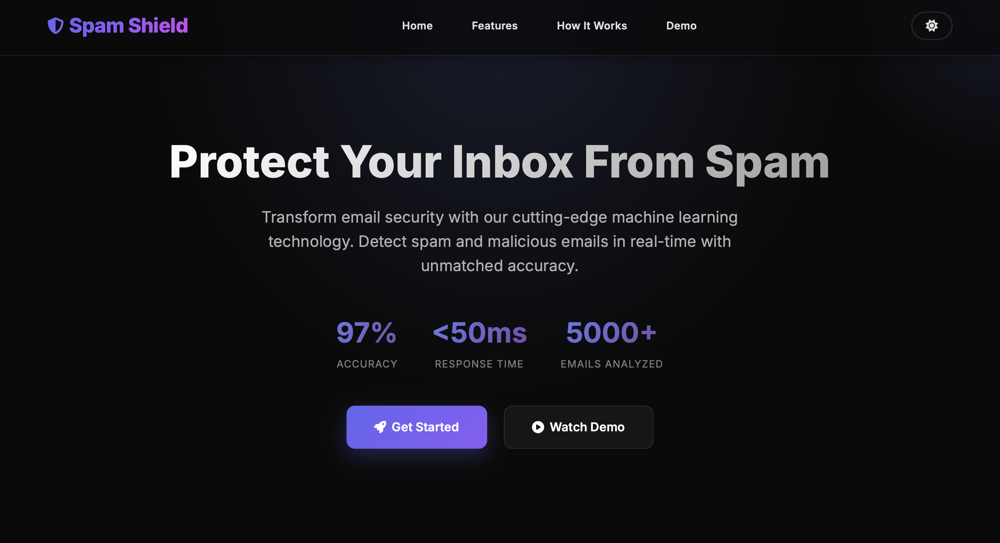

<div align="center">
  <br />
  <h1>🛡️ SPAM SHIELD</h1>
  <p>
    <em>An Email Spam Detection System powered by machine learning <br /> 
    that analyzes email content in real-time with 97% accuracy using TF-IDF vectorization and logistic regression.</em>
  </p>

  <p>
    
    
    
    
    
  </p>

  <div>
    <a href="https://spam-shield-626j.onrender.com/#home" target="_blank">
      
    </a>
  </div>

<br>
  <!-- Add your demo screenshot/video here -->
  <div>
    <a href="https://spam-shield-626j.onrender.com/#home" target="_blank">
      
    </a>
  </div>
  
  <br />
  <!-- <div>
    <a href="#" target="_blank">
      
    </a>
  </div> -->
</div>

---

## ✨ What is Spam Shield?

Spam Shield is an email classification system that:
- Analyzes email content using advanced machine learning algorithms  
- Provides instant spam detection with **97%+ accuracy**  
- Uses TF-IDF (Term Frequency-Inverse Document Frequency) vectorization for feature extraction  
- Employs logistic regression for binary classification (spam vs. legitimate)  
- Offers a clean, responsive web interface with dark/light theme support  

It helps users identify spam emails, phishing attempts, and malicious content before they become a threat.

---

## Core Features Overview

| Feature              | Description                                                                 |
|----------------------|-----------------------------------------------------------------------------|
| **ML-Powered Detection** | Trained on 10,000+ email samples using logistic regression algorithm      |
| **TF-IDF Vectorization** | Advanced text feature extraction for accurate pattern recognition       |
| **Real-time Analysis**   | Instant classification results in under 50ms                            |
| **Responsive UI**        | Modern interface with dark/light theme toggle and smooth animations     |
| **High Accuracy**        | Achieves 97% accuracy on test data                                   |
| **Privacy-Focused**      | No data storage - all processing happens locally                        |

---

## Tech Stack

- **Python** – Core programming language with modern features  
- **Flask** – Lightweight web framework for API routing and templating  
- **scikit-learn** – Machine learning library for model training and prediction  
- **Pandas & NumPy** – Data manipulation and numerical computing  
- **HTML5/CSS3/JavaScript** – Modern, responsive frontend with theme switching  

---

## Architecture Overview

```
User Input → TF-IDF Vectorization → Logistic Regression Model → Classification → UI Display
```

- User enters email content through the web interface  
- Flask backend receives the request and preprocesses the text  
- TF-IDF vectorizer converts text into numerical feature vectors  
- Pre-trained logistic regression model classifies the email  
- Result is returned with visual indicators (spam/legitimate)  

---

## 📊 How It Works

| Step | Process | Details |
|------|---------|---------|
| **1. Input** | User enters email content | Clean, intuitive textarea with example templates |
| **2. Preprocessing** | Text cleaning & normalization | Handles null values, removes noise |
| **3. Feature Extraction** | TF-IDF vectorization | Converts text to numerical feature vectors |
| **4. ML Prediction** | Logistic regression analysis | Binary classification with probability scores |
| **5. Result Display** | Visual feedback to user | Color-coded results with confidence indicators |

---

## 📁 Project Structure

```
Spam-Shield/
├── app.py                                   # Flask application (main entry)
├── Email_Spam_Classification.ipynb          # Model training notebook
├── logistic_regression.pkl                  # Serialized ML model
├── feature_extraction.pkl                   # Serialized TF-IDF vectorizer
├── mail_data.csv                            # Training dataset (5000+ emails)
├── requirements.txt                         # Python dependencies
├── templates/
│   ├── landing.html                        # Modern landing page
│   └── index.html                          # Email classifier interface
└── README.md                                # Documentation
```

---

## 🌐 Connect with Me

<div align="center">
  Want to collaborate or have questions? Let's connect!
  <br /><br />
  <a href="https://www.linkedin.com/in/rajadigvijaysingh/" target="_blank">
    
  </a>
</div>

---
